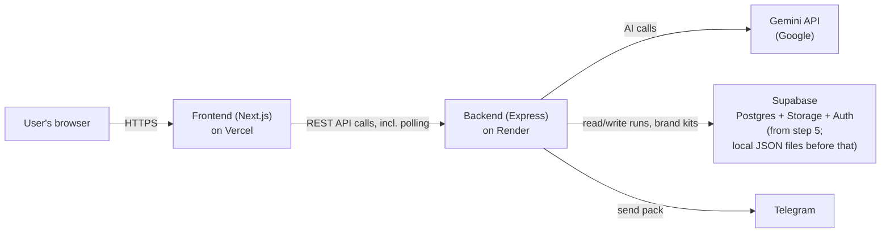

# ARCHITECTURE — VPO Studio

This document describes how VPO Studio is built. It's written for a non-technical reader — every technical term is explained in plain words the first time it appears. See `AGENTS.md` at the project root for the product flow and build plan.

---

## 1. The parts, and where each runs

| Part | What it does | Runs on |
|---|---|---|
| **Frontend** | The web pages the user sees and clicks through (Brief, Story, Direction, Look, Storyboard, Pack, Approve, History) | Vercel (a hosting service specialised for web front-ends) |
| **Backend** | Does the actual work: calls Gemini (Google's AI), tracks cost, runs long jobs, talks to the database | Render (a hosting service for backend servers) |
| **Gemini API** | Google's AI service — writes facts/scripts/prompts, scores quality, generates images | Google's servers (called over the internet by the backend only) |
| **Supabase** (from step 5) | Postgres database (structured data storage), file storage (for images), and Auth (user sign-in) | Supabase's hosted service |
| **Telegram** (from step 5) | Lets a user send their finished pack to a Telegram chat | Telegram's servers (called by the backend) |

The frontend never talks to Gemini, Supabase, or Telegram directly — it only ever talks to our own backend, which then talks to those services. This keeps every secret key on the server and gives us one place to add logging, rate limiting, and cost tracking.

---

## 2. Data model

"Data model" = the shapes of information the app stores and how they connect. Every table below belongs to a single user once Supabase is in place (step 5); before that, everything is scoped to one local test user.

| Table | Holds | Key fields (plain English) |
|---|---|---|
| `users` | One row per signed-in person | id, email, name, created date |
| `brand_kits` | One saved Brand kit per user | user it belongs to, brand name, colour palette, character description, tone of voice, constraints, preferred platforms |
| `runs` | One row per topic-to-pack journey | user it belongs to, the Brief (topic, audience, platform, aspect ratio, duration, target video model), current stage, job status, whether Autopilot is on, running total cost, created/updated dates |
| `facts` | The 5–8 facts found for a run | which run, the fact text, "stated" or "implied" label, which source it came from |
| `sources` | Where facts came from | which run, the source's URL and title, exactly as returned by Google Search grounding (never a URL typed by the AI itself) |
| `scripts` | The timestamped script (and edits to it) | which run, version number, the beats (start/end time, VISUAL, VO, ON-SCREEN text for each), word count |
| `directions` | The 3 proposed creative directions, and which was picked | which run, name, hook, angle, look, mood, one-line summary, whether selected, the user's optional note |
| `video_prompts` | Each attempt at the full video-generation prompt | which run and direction, the prompt text, the negative prompt, the 5 quality scores plus overall, which attempt number, whether it passed |
| `frames` | Each storyboard image (key frame + up to 5 more) | which run, which script beat it's for, whether it's the key frame, the image's storage location, the 6 quality scores, attempt number, status, whether it was AI-generated or user-uploaded |
| `packs` | The final publishing package | which run, final video prompt + negative prompt, title, captions per platform, hashtags, thumbnail text, posting notes, approved or not |
| `ai_call_log` | Every single call made to Gemini | which run and stage, which model, call type (text/image/grounding), token or image counts, estimated cost, outcome |

### Status values

| Field | Possible values | Meaning |
|---|---|---|
| `runs.current_stage` | `brief` → `story` → `direction` → `look` → `storyboard` → `pack` → `approve` → `done` | Which step of the flow (section 2 of AGENTS.md) the run has reached |
| `runs.job_status` | `idle`, `queued`, `running`, `waiting_confirmation`, `needs_review`, `interrupted`, `failed`, `completed` | The state of whatever background job is currently attached to the run (see section 4) |
| `ai_call_log.outcome` | `success`, `retried`, `failed` | What happened to that specific AI call |

`waiting_confirmation` = paused for a cost-confirmation click (e.g. before rendering images). `needs_review` = paused at one of the ★ human-checkpoint steps. `interrupted` = the backend restarted mid-job and the user needs to resume it manually.

---

## 3. Backend API routes

"Route" = one specific web address the frontend can call. All routes below live under `/api` and require a signed-in user from step 5 onward.

| Route | One-line purpose |
|---|---|
| `GET /api/health` | Reports whether the backend, its configured Gemini models, and the database (once added) are all working |
| `POST /api/runs` | Starts a new run from a Brief (or an uploaded script) |
| `GET /api/runs` | Lists the signed-in user's runs, for the History page |
| `GET /api/runs/:id` | Fetches one run's full current state (used for polling and reopening) |
| `POST /api/runs/:id/story` | Kicks off the Story job: fact-finding + script generation |
| `PATCH /api/runs/:id/facts` | Applies a fact removal (and triggers a script rewrite) |
| `PATCH /api/runs/:id/script` | Saves manual edits to the script |
| `POST /api/runs/:id/directions` | Generates the 3 creative directions |
| `POST /api/runs/:id/directions/:directionId/select` | Picks a direction (with optional note) and kicks off prompt writing + scoring |
| `GET /api/runs/:id/cost-estimate` | Returns the estimated cost of the next paid step, for a confirmation dialog |
| `POST /api/runs/:id/key-frame` | Confirms cost and renders the key frame |
| `POST /api/runs/:id/key-frame/upload` | Accepts a user-uploaded image instead of generating one |
| `POST /api/runs/:id/key-frame/regenerate` | Regenerates the key frame with a user note |
| `POST /api/runs/:id/storyboard` | Renders the remaining storyboard frames from the approved key frame |
| `POST /api/runs/:id/frames/:frameId/regenerate` | Regenerates one storyboard frame with a user note |
| `POST /api/runs/:id/pack` | Generates the Pack (prompts, captions, hashtags, etc.) |
| `PATCH /api/runs/:id/pack` | Saves manual edits to the Pack |
| `POST /api/runs/:id/approve` | Marks the Pack approved |
| `GET /api/runs/:id/export` | Downloads the approved Pack as a zip file |
| `POST /api/runs/:id/send-telegram` | Sends the approved Pack to a configured Telegram chat |
| `GET /api/runs/:id/jobs/:jobId` | Polls a specific background job's status (see section 4) |
| `GET /api/brand-kit` | Fetches the signed-in user's Brand kit |
| `PUT /api/brand-kit` | Creates or updates the signed-in user's Brand kit |
| `GET /api/usage` | Returns the user's running cost and daily-limit usage (built in step 7) |

---

## 4. Long jobs, polling, interruption, and resume

Some steps (research with grounding, script writing, prompt scoring loops, image generation) take several seconds to over a minute. These run as **background jobs** on the backend rather than making the user's browser wait on one long connection, which is fragile over slow networks and impossible to resume if it drops.

- **Starting a job**: an API call (e.g. `POST /api/runs/:id/story`) creates a job record — saved in the same storage as the run itself, never only in the server's memory — and returns immediately with a job ID.
- **Polling**: the frontend calls `GET /api/runs/:id` (the job-specific route is also available) every second while the run status is `queued` or `running`. This is simpler and more robust than push-based updates, and works fine at this app's scale (see Scaling, section 6).
- **Interruption**: because every job's progress is saved with the run (not just kept in memory), if the backend process restarts — a deploy, a crash, Render recycling the instance — any job that was `running` is marked `interrupted` the next time it's checked, instead of silently vanishing.
- **Resume**: the user can resume an `interrupted` run from the History page. Resuming re-runs only the specific step that was interrupted, using everything already saved (facts already found, script already written, etc.) — never redoing completed work.
- **Multiple backend copies**: saving state alone does not prevent duplicate work. The local JSON implementation enforces one process per data folder. Step 5 must provide shared database job claims and a shared concurrency limit before multiple workers are enabled.
- **Autopilot** (step 7) uses this exact same job system. Instead of a person clicking "next" at each ★ checkpoint, Autopilot automatically starts the next job the moment the previous one completes — except at cost confirmations and the final approval, where it still pauses for the user, exactly like the manual flow.

---

## 5. Test mode

`TEST_MODE=true` (the default) makes every AI call — text, scoring, and image — return realistic, hand-crafted sample data instantly, at zero cost, instead of calling Gemini. This lets the whole flow be built and demonstrated (steps 2–4) before any real API key or spending is involved, and lets automated tests run without cost or flakiness. Whenever `TEST_MODE` is on, the interface shows a persistent "TEST MODE" badge so no one mistakes sample output for a real result. Turning it off (a single environment variable) is the only thing required to start making real, billed AI calls.

Separately, if the **frontend** has no backend address configured at all (e.g. viewing it standalone), it falls back to built-in sample data and shows a "SAMPLE DATA" badge — useful for step 2, before any backend exists yet.

---

## 6. Environment variables

"Environment variable" = a named setting supplied outside the code (so it can differ between your computer, a teammate's, and the live server, without editing code). Real values live in `.env` files that are never committed to Git; `.env.example` files (committed) show which variables exist with placeholder values.

### Backend (`/backend/.env`)

| Variable | Purpose |
|---|---|
| `PORT` | Port the Express server listens on |
| `TEST_MODE` | `true`/`false` — see section 5 |
| `GEMINI_API_KEY` | Google Gemini API key (server-side only, never sent to the browser or logged) |
| `GEMINI_MODEL_MAIN` | Model ID used for research, scripts, directions, and prompt writing |
| `GEMINI_MODEL_SCORING` | Cheaper model ID used only for quality scoring/review |
| `GEMINI_MODEL_IMAGE` | Model ID used for key-frame and storyboard image generation |
| `GEMINI_MAX_CONCURRENT_CALLS` | Cap on simultaneous Gemini calls |
| `GEMINI_RETRY_MAX_ATTEMPTS` | Max retries on a rate-limit error (default 2) |
| `PROMPT_SCORE_THRESHOLD` | Minimum passing score for a video prompt |
| `PROMPT_MAX_REWRITE_ATTEMPTS` | Cap on automatic prompt rewrite/rescoring loops |
| `FRAME_SCORE_THRESHOLD` | Minimum passing score for a storyboard frame |
| `FRAME_MAX_TOTAL` | Max frames per run (default 6, including the key frame) |
| `FRAME_MAX_MANUAL_REGENERATIONS` | Cap on user-requested regenerations per frame |
| `RESEARCH_CACHE_HOURS` | How long research is reused for the same user+topic (default 24) |
| `STORAGE_MODE` | `local_json` (pre-step-5) or `supabase` (from step 5) |
| `STORAGE_LOCAL_PATH` | Folder for local JSON run files (pre-step-5 only) |
| `SUPABASE_URL`, `SUPABASE_SERVICE_ROLE_KEY` | Supabase connection (from step 5) |
| `TELEGRAM_BOT_TOKEN` | Telegram bot credential for sending packs (from step 5) |
| `USER_DAILY_RUN_LIMIT` | Per-user daily cap on new runs (from step 7) |
| `USER_DAILY_COST_LIMIT` | Per-user daily cap on estimated spend (from step 7) |
| `ERROR_TRACKING_DSN` | Error-tracking service key (from step 7) |

### Frontend (`/frontend/.env`)

| Variable | Purpose |
|---|---|
| `NEXT_PUBLIC_API_URL` | Address of the backend API. If unset, the frontend shows sample data with a "SAMPLE DATA" badge |
| `NEXT_PUBLIC_SUPABASE_URL`, `NEXT_PUBLIC_SUPABASE_ANON_KEY` | Public Supabase client config for sign-in (from step 5) |

---

## 7. Cost model

Prices below are Google's published Gemini API prices, checked **2026-09-24** (see `docs/DECISIONS.md` for full sourcing). All figures are the *standard* (non-batch) tier.

**Default models**: `GEMINI_MODEL_MAIN = gemini-3.8-flash` ($0.75 / $3.75 per 1M input/output tokens), `GEMINI_MODEL_SCORING = gemini-3.5-flash-lite` ($0.30 / $2.50 per 1M input/output tokens), `GEMINI_MODEL_IMAGE = gemini-3.1-flash-image` (≈$0.045 per generated image at standard resolution). "Tokens" are the chunks of text an AI model is billed by, roughly ¾ of a word each.

### Estimated cost of one full run (6 frames, default settings)

| Stage | AI work | Estimated cost |
|---|---|---|
| Story | Facts + script (1 main-model call, grounded) | $0.007 |
| Direction | 3 directions + prompt writing/scoring loop (up to 3 attempts) | $0.016 |
| Look | 1 key-frame image | $0.045 |
| Storyboard | 5 more frames + automatic frame scoring + ~2 automatic regenerations | $0.32 |
| Pack | Captions, hashtags, notes (1 main-model call) | $0.005 |
| Google Search grounding | 1 grounded request | $0.00 (within free monthly allowance*) |
| **Total** | | **≈ $0.39** |

\* Google currently gives 5,000 free grounded search requests per month shared across all Gemini 3.x models, then charges $14 per 1,000 requests. At low volumes this stays free; see Scaling below for when it stops being free.

**Image generation is roughly 90% of the cost of a run.** Everything else is a rounding error by comparison.

### Levers that reduce cost, and their saving

| Lever | How | Saving |
|---|---|---|
| Fewer storyboard frames | Lower `FRAME_MAX_TOTAL` from 6 to 4 | ≈$0.09 (~23% of run cost) |
| Fewer automatic frame regenerations | Lower the implicit "regenerate once" retry, or raise `FRAME_SCORE_THRESHOLD` less aggressively so fewer frames fail | ≈$0.045 per regeneration avoided |
| Research reuse | Already default: identical research inputs within 24h skip research and fact review; the script is still written for the new run | ≈$0.007 + avoids a grounding request, per repeat run |
| Fewer prompt rewrite attempts | Lower `PROMPT_MAX_REWRITE_ATTEMPTS` from 3 to 2 | ≈$0.005 |
| Cheaper image model for storyboard, higher-quality only for the key frame | Use `gemini-3.1-flash-lite-image` for storyboard frames, reserve full quality for the key frame | Image cost per storyboard frame can drop further; exact figure to confirm against current per-model image pricing before implementation |
| User uploads their own key frame | Free — skips one image generation entirely | $0.045 |

---

## 8. Scaling

"Breaks first" = the bottleneck that would actually cause failures or unacceptable slowness at that many **active** users (people running the flow in a given day), not total signups.

| Active users | What breaks first | Fix |
|---|---|---|
| 10 | Render's free-tier instance "cold starts" (spins down when idle, then takes several seconds to wake up on the next request) | Acceptable at this scale; if it's annoying, move to a paid Render instance that stays warm |
| 100 | Gemini's per-project rate limits (requests per minute) start throttling during overlapping runs; Google Search grounding's free monthly allowance (5,000 requests, shared across the whole app) gets used up | Move to a paid Gemini billing tier with higher rate limits; budget for grounding cost beyond the free allowance ($14/1,000 requests) |
| 100 | The local-JSON-file storage (used before step 5) can't handle concurrent writes safely from multiple backend copies | Must already be on Supabase by this point (planned for step 5, well before this scale is expected) |
| 1,000 | Gemini's overall request-per-minute and tokens-per-minute quotas become the binding constraint even on a paid tier | Request a quota increase from Google, and/or spread load with request queuing so bursts don't all hit Gemini at once |
| 1,000 | A single Render backend instance runs out of CPU/memory handling many concurrent long-running jobs | Run multiple backend copies behind Render's load balancer — after shared job claims and a shared limiter are implemented in step 5 (section 4) |
| 1,000 | Supabase free/starter tier database connection and storage limits are exceeded | Upgrade the Supabase plan; add connection pooling for the database |
| 1,000 | Runaway spend if many users run the flow simultaneously with no cap | Per-user daily run and cost limits (step 7) become load-bearing, not just a nice-to-have |

---

## 9. Production readiness checklist

| Item | What it means | Delivered by step |
|---|---|---|
| Accounts and data separation | Every run/Brand kit belongs to one user; server sets ownership; every query filtered to the signed-in user | 5 |
| Secrets kept server-side | API keys only in `.env`, gitignored, never sent to the browser or logged | 1 (as a rule), enforced from 3 onward |
| Limits and cost caps | Per-run frame/retry/regeneration limits; per-user daily run and cost limits | 3 (per-run), 7 (per-user daily) |
| Error tracking | Real errors captured centrally (not just shown once and lost) with an error-tracking service | 7 |
| Health checks and uptime | `/api/health` confirms backend, configured Gemini models, and database are all reachable | 3 (backend/models), 6 (full stack live) |
| Backups | Supabase's automatic database backups relied on and confirmed enabled | 5 |
| Free-tier limits and upgrade triggers | Render free tier: cold starts, limited monthly hours. Supabase free tier: limited database size, storage, and monthly active users (check Supabase's current published free-plan limits close to step 5/6, since providers change these). Gemini: free grounding allowance of 5,000 requests/month (checked 2026-09-24) | 6 (checked before going live), revisited at each scaling milestone (section 8) |
| Data privacy | Users only ever see their own runs and Brand kit; no run data shared across accounts; source links only ever come from grounding metadata, never invented | 5 |
| Model retirement handling | Model IDs are environment variables (never hardcoded); health check fails loudly if a configured model no longer exists; `docs/DECISIONS.md` tracks known retirement dates so a model can be swapped before it's shut down | 3 (mechanism), ongoing (monitoring retirement dates) |

## Step 3 implementation contract (2026-09-25)

The frontend uses one API client, with no error fallback. With an API URL configured, History, New run, Brand kit and Story read/write backend JSON storage. Direction through Approve are deliberate, zero-cost sample handlers, flagged `sampleStages` and labelled SAMPLE. They never call Gemini, even in live mode. The existing browser zip export remains a sample feature; server export, Telegram and Usage remain for later steps.

### Persistence and jobs

`storage.ts` exposes `init`, `close`, `createRun`, `getRun`, `listRuns`, `updateRun`, `getBrandKit`, `saveBrandKit`, `findResearch`. This is the persistence boundary that Supabase replaces. Every run belongs to the server-assigned `local-user`; browser ownership fields are ignored. Writes are serialized (one at a time) and replace files by atomic rename (readers see a complete old or new file). A process lock refuses a second backend using the same folder. This is local development storage, not a distributed database.

A run stores a job ID, kind (`story` or `rewrite`), status, checkpoint, start time, message, error and saved action inputs. Story checkpoints: `start`, `researched`, `reviewed`, `scripted`; selective rewrites begin at `rewrite`. Startup marks queued/running jobs interrupted. Resume repeats only the unfinished checkpoint. Calls interrupted before their response returns may already have been billed; those costs are marked unknown rather than presented as measured zero. A provider response lost before saving its checkpoint can require another call on resume; exactly-once provider billing cannot be guaranteed.

New routes: `POST /api/runs/:id/resume` resumes an interrupted job; `GET /api/runs/:id/ai-calls` returns its saved call ledger. `POST /story` accepts `{fresh:true}` to bypass research reuse. Job-start endpoints return HTTP 202 and the updated run including its job ID, rather than keeping a connection open for the work.

### Sources, evidence and scripts

Research requests numbered atomic statements with Google Search enabled through the official SDK `models.generateContent` API. Live validation found JSON-constrained research could omit grounding metadata; prose preserved it. A deterministic parser preserves each numbered claim. JSON fixtures remain supported; malformed replies report a redacted prefix. Script and review calls still request JSON. Schema validation rejects malformed facts or beats.

Only `groundingChunks[].web` creates sources. `groundingSupports` associates exact generated claim text with chunk indexes. A source stores both original and resolved URLs, resolution state (`direct`, `resolved`, `unresolved`) and retrieved page text. The server follows public HTTPS redirects with bounded time, size and redirect count; private addresses are blocked. Failed Google redirect resolution retains the original URL and marks it unresolved.

A grounding support segment is a cited passage of the generated answer, **not a quote from the publisher**. We therefore retrieve text from those metadata-sourced pages for fact review. The cheaper model checks each claim against that text, with stated/implied/unsupported labels. Missing page evidence forces unsupported regardless of the model label. Unsupported claims are removed and saved in `research.dropped`; missing grounding yields `research.status=uncited`, a visible warning, and no fabricated sources. If no facts survive, the job fails with an explicit explanation.

Scripts retain a `factIds` list per beat, an author (`ai` or `user`), version, narration word count and speaking rate. Fact removal sends only affected beats for rewrite and validates unchanged IDs/times and permitted facts. Other beats remain unchanged. Manual saves preserve the exact entered text plus earlier script versions. Plain pasted narration is one beat; timestamped scripts are parsed into beats. The length check counts VO only, excluding camera directions and on-screen text.

The 24-hour cache includes local owner, topic, audience, source links, notes, test/live mode and writing/review model IDs. This is stricter than topic alone, to avoid reusing research under different instructions or accidentally using test research in live mode. A cache hit still generates a new script.

### Settings and cost

Additional settings: `FRONTEND_ORIGINS` (comma-separated browser origins), `SPEAKING_RATE` (default 2.5 words/second), `GEMINI_RETRY_DELAY_MS`, `TEST_DELAY_MS`, and `MAIN_INPUT_PRICE`, `MAIN_OUTPUT_PRICE`, `SCORING_INPUT_PRICE`, `SCORING_OUTPUT_PRICE` (USD per million tokens), `IMAGE_PRICE`, `SEARCH_REQUEST_PRICE` (USD per request). See `backend/.env.example` for defaults. Test delay is 350ms per call so progress is observable; automated tests can override it. No network calls are made by the AI/source fixture path in test mode.

Each attempt is saved before calling the provider, then completed with token counts, output thinking tokens, image count, estimated search requests, duration, outcome and redacted error. Outcomes now include `pending` and `interrupted` alongside `success`, `retried`, `failed`. The run cost is recalculated from the ledger on every write. Only HTTP 429 is retried, at most twice; SDK automatic retries are disabled for generation.

Story now consists of **three calls**: grounded research, batch review of every fact, and script generation. The earlier $0.007 Story row is a preliminary step-1 assumption, not a measured run price. Example planning allowance: 2,000/2,000 main input/output tokens across research+script, 10,000/1,000 review input/output tokens, and one search request costs $0.0285 ($0.009 main + $0.0055 review + $0.014 search). Larger retrieved pages or multiple search queries increase this. The ledger uses actual returned usage; search query count is an estimate and does not deduct account-wide free allowances. It is not a provider invoice. Test calls are always exactly $0.

Health reports mode, key presence and configured model availability; test mode skips provider checks. Live model errors make health unhealthy. CORS permits only listed browser origins. The development server binds to loopback; accounts, production deployment and central error tracking remain future steps.

## Step 4 implementation contract (2026-09-25)

This section supersedes the Step 3 sample contract for Direction, Look and Storyboard only. The practical flow ends at **approved Storyboard**; Pack and Approve remain clearly SAMPLE. Earlier sections describing later stages remain the original plan, not additional implementation in this step.

### Saved data and job flow

The shared types file adds `Run.generation`, a saved record containing:

| Record | Saved information |
|---|---|
| Direction choice | Exactly three directions; chosen ID and note on the run; current local Brand kit snapshot |
| Prompt attempts | Revision, attempt number, exact prompt, negative prompt, constant visual description, direction/note, five validated scores and feedback, linked AI calls, reason for change |
| Key-frame versions | Image ID/URL, generated or uploaded source, note, approval/rejection/replacement, linked calls |
| Storyboard | Frame order, all mapped beat IDs, visual instruction, attempts, selected best attempt, six scores/feedback, retry-limit state, approval time |
| Previous Storyboards | Complete archived frames and reviews after their direction or reference changes |
| Cost quotes | Action and exact inputs, itemised estimate, limits/prices fingerprint, expiry, consuming job, optional recovery job |
| Activity | Time, job, checkpoint, message, state and origin: user, automatic prompt improvement, automatic frame regeneration or provider retry |

Job kinds add `directions`, `prompt`, `key`, `key-regenerate`, `board`, `frame-regenerate`. Stage and job-status values are unchanged. Activity states add pending, waiting, retrying and resumed descriptions; these are saved events, not new run statuses. Each job stores completed checkpoints and completion time. Prompt generation and review are separate checkpoints for every version; each image generation and review is separately saved. A mapping checkpoint creates the ordered frame plan before any remaining frame is rendered.

The existing backend runner executes these jobs and the frontend continues polling once per second. Startup marks unfinished jobs interrupted. Resume skips completed checkpoints and also checks for saved outputs when a crash happened between saving an output and marking its checkpoint complete. A saved image awaiting review is reused. Any provider response lost before storage may require another request; its unknown cost remains visible. Live image recovery requires another explicit itemised confirmation. Local JSON still permits exactly one backend process.

All AI tasks use the shared Gemini gateway. It accepts actual image parts for generation and multimodal review (review of images and text together). The generated frame is the first review image, the approved key is the second. Each call log retains stage, task, job, origin, model, request attempt, duration, usage and estimated cost. Hashes identify the submitted image bytes for test assertions; raw requests, internal prompts, secrets and filesystem paths are not UI deliverables.

### New or replaced routes

All return saved data; long-job starts return HTTP 202. Existing Step 3 routes remain.

| Route | Behaviour |
|---|---|
| `POST /api/runs/:id/directions` | Approve completed Story (or accept a pasted script) and generate exactly three directions |
| `POST /api/runs/:id/directions/:directionId/select` | Save choice/note, invalidate dependent work, generate and review a full prompt |
| `POST /api/runs/:id/image-quotes` | Save itemised quote for key, key-regenerate, board or frame-regenerate; optional `resume` quotes an interrupted/failed job |
| `POST /api/runs/:id/key-frame` | Consume matching `quoteId` and schedule key-frame generation |
| `POST /api/runs/:id/key-frame/regenerate` | Consume a fresh quote with written note and schedule a new key version |
| `POST /api/runs/:id/key-frame/upload` | Decode and validate image contents, store safely, invalidate prior approval/Storyboard; no AI call |
| `POST /api/runs/:id/key-frame/approve` | Approve the explicit current `keyId`; allow Storyboard cost confirmation |
| `POST /api/runs/:id/key-frame/reject` | Reject current Look and invalidate its dependent Storyboard |
| `POST /api/runs/:id/storyboard` | Consume matching quote after Look approval; map beats, generate and review remaining frames |
| `POST /api/runs/:id/frames/:frameId/regenerate` | Consume frame-specific quote/note and regenerate only that frame, enforcing the per-run manual cap |
| `POST /api/runs/:id/storyboard/approve` | Approve completed Storyboard and end Session 10.3 without entering a real Pack workflow |
| `GET /api/images/:assetId` | Serve stored PNG bytes by validated opaque image ID, never by a browser-supplied path |
| `POST /api/runs/:id/resume` | Existing route now also resumes interrupted or explicitly retried failed generation jobs; live image work requires a fresh recovery quote through its generation route |

The old `GET /cost-estimate` remains only for legacy sample screens; real Step 4 actions use saved `/image-quotes` and cannot use its zero-cost response as authorization.

### Storage and image handling

`storage.ts` adds `saveImage(bytes)` and `readImage(id)` to its existing interface. Default local paths are `backend/data/run-<id>.json` for run, prompt/review/activity/call history, and `backend/data/images/<generated-id>.png` for image files. Application modules never directly read or write runtime files. The storage module remains the replacement boundary. Generated and uploaded images are decoded and re-encoded as PNG; metadata and unsafe filenames are not retained. The server enforces byte and decoded-pixel limits.

### Limits, settings and estimates

New settings (see `backend/.env.example`): `PROMPT_QUALITY_THRESHOLD=75`, `PROMPT_REWRITE_LIMIT=2`, `FRAME_QUALITY_THRESHOLD=70`, `FRAME_AUTO_REGENERATION_LIMIT=1`, `MANUAL_REGENERATION_LIMIT=6`, `MAX_TOTAL_FRAMES=6`, `UPLOAD_SIZE_LIMIT_BYTES=5242880`, `IMAGE_PRICE=0.067`, `IMAGE_INPUT_PRICE=0.5`, `IMAGE_TEXT_OUTPUT_PRICE=3`. Existing writing/review model, token-price and concurrency settings remain. Resolution is explicitly 1K so the image setting matches the quote. All money is USD.

A quote expires after 15 minutes and is valid only for its saved action and inputs. Automatic replacements and up to two HTTP 429 retries per request are included. Consumption and job creation are one serialized update. Double-clicking the same quote does not schedule another job. Quotes are recalculated if model/prices, input revision or key reference changes. Uploads need no paid-action quote.

For a planning example with six images and no replacements: image outputs cost 6 × $0.067 = **$0.402**. Assuming each image request uses 2,000 input and 300 text/thinking output tokens adds $0.0114. Five reviews at 3,000 input/500 output tokens add $0.01075; directions plus one prompt at 2,000 input/1,500 output each add $0.01425; one prompt review at 4,000 input/700 output adds $0.00295. Step 4 then totals approximately **$0.44135**, excluding Story, replacements and rate-limit retries. The earlier Story planning example adds $0.0285, giving about **$0.46985 through Storyboard**. These are stated assumptions, not measured live costs or a finished Pack price.

Confirmation quotes deliberately use larger token allowances (56,000 input and 6,000 output per request) and all allowed request attempts. They can be much higher than that planning example. A provider invoice can differ; the UI calls these estimates. The ledger replaces assumptions with returned usage and image counts. Image tokens are excluded from text-output pricing so they are not double-counted. All TEST_MODE calls and quotes cost exactly zero.

### Test mode and UI

`TEST_SCENARIO` is an optional test-only fixture selector: `pass`, `prompt-improve`, `prompt-fail`, `frame-improve`, `frame-fail`, `provider-error`. It has no effect on live responses. Fixtures return the SDK response shape and local PNG bytes through the same validation, storage, review and UI paths. They make no provider or fixture-image network requests.

Direction/Look/Storyboard have no SAMPLE badge with a backend configured. TEST MODE remains visible. Completed stages can be inspected through local tabs. Expandable histories expose every version, score and call; activity comes from backend state, so reopening preserves it. Costs are shown by stage and by call, with unknown usage identified. Errors never fall back to browser samples. With no backend URL, the original standalone SAMPLE DATA flow still works.

## Corrective implementation — 2026-09-26 (Steps 3–4)

This section supersedes earlier implementation details about automatically copying the Brand kit at Direction, requiring five facts, and sending the complete video prompt to the image model. Session 10.3 ends at approved Storyboard. Pack and Approve remain SAMPLE.

### Brief, evidence and versions

`run.effective` is the approved interpretation: subject, objective, product description, visual preferences, factual constraints, summary, confirmation, Brand kit choice and revision number. Platform only sets the publishing format. The run contains its own Brand kit snapshot. New creation defaults to no kit; saved and run-specific options require a choice. An unconfirmed interpretation or obvious clothing/coffee conflict blocks generation.

Research records its actual grounding queries and request brief. Up to eight useful facts are reviewed for both evidence and relevance. Sources still come only from grounding metadata and retrieved source text; unavailable evidence is dropped. A creative product-led script can use zero factual claims. Each beat has stable IDs, optional fact IDs and a claim type: creative, supported, or manually edited/unverified. No fact IDs are assigned to a newly hand-written claim merely because an older beat cited them. An independent fidelity check must pass before Story approval is recorded.

| Saved record | Purpose |
|---|---|
| `effective.revision`, `script.version`, `storyApproval` | Bind approval to exactly the brief and script reviewed |
| `feedbackHistory`, `scriptVersions`, `job.revisionDraft` | Feedback status, prior scripts, change summaries and a saved draft for restart recovery |
| `history` | Outdated brief, evidence, scripts, feedback, Brand kit, directions and image work; retained rather than deleted |
| `generation.prompts[].inputSnapshot` | Canonical brief/script/direction/feedback input for the displayed prompt |
| Prompt/image `review.criticalFailures` | Specific wrong-subject/objective, brand-contamination or unsupported-claim failures that prevent a pass |
| Image `stillPrompt`, `referenceAssetId` | Exact visible-image instructions and identity reference used for generation/review |
| Run/artifact `mode` | `test`, `live` or legacy `unknown`; never derived from today's server mode |

Script-feedback statuses are `pending`, `completed`, `failed`, `needs_research`. The added job kind is `script-revision`; its saved checkpoints include `revision`, `revision-written` and `scripted`. Existing stage and job-status values remain unchanged. Every model call still uses the common gateway, including revisions and key-frame reviews.

### Added or strengthened routes

All routes have the `/api` prefix. `scriptVersion` and `briefRevision` are comparison tokens: outdated requests fail instead of overwriting newer work.

| Route | Behaviour |
|---|---|
| `POST /runs` | Save explicit interpretation, provenance and selected Brand kit snapshot; ambiguous runs cannot start generation |
| `PATCH /runs/:id/brief` | Require expected brief revision, archive dependent work, save new interpretation and clear obsolete research/script |
| `POST /runs/:id/story/reopen` | Require `confirmInvalidation:true`; archive work and invalidate downstream active selections/approvals |
| `PATCH /runs/:id/script` | Save direct edits with exact version checks and retain previous script |
| `POST /runs/:id/script/revise` | Persist feedback and queue targeted or full revision using the current saved inputs |
| `POST /runs/:id/script/restore` | Restore a prior script as a new version, with concurrency checks |
| `POST /runs/:id/directions` | Require exact script/brief versions; check fidelity before binding approval and generating three directions |
| `POST /runs/:id/prompt/revise` | Require current prompt ID; generate/rescore feedback revision and invalidate dependent quotes/approvals |
| `POST /runs/:id/product-reference` | Validate image bytes and save identity reference without AI generation; freeze before Look starts |
| Existing key-frame/Storyboard approval routes | Reject stale inputs; generated Look must pass review, and Storyboard must have no critical subject/factual failures |

Reopen is required before modifying approved Story/brief. Edits cannot run while a job is queued, running or interrupted. Local storage serializes updates in one process. Resume reuses saved outputs and the saved script revision draft; completed storyboard frames are skipped. A provider result lost before persistence still has unknown live usage and is not claimed to be free.

### Visual generation and cost control

The key frame and each mapped frame receive a dedicated still prompt: subject/product, visible moment, composition, setting, lighting, visual identity, relevant constraints and user feedback. The full video prompt retains narration/editorial overlays, but those are not dumped into image requests. Actual image bytes reach generation and review. The key frame is automatically reviewed, optionally repaired within the confirmed allowance, and then approved by a person. Failed key images do not establish reference identity. Uploaded finished Looks retain the explicit human approval path.

At default prices/caps, the conservative confirmed allowance per generated frame slot is **$0.8688**: up to two image versions, each with one review, with three provider-request attempts reserved for 429 errors. It comprises $0.402 image output, $0.276 image input/text-thinking allowance and $0.1908 review allowance. A six-frame board plus one manual frame revision has a combined upper planning allowance of **$6.0816**, confirmed in separate actions; it is not the expected spend or a provider invoice. Typical successful image output alone is $0.067 per frame, plus returned input, text/thinking and review usage. Text research/revision/prompt costs are logged separately. Allowances are not a global account spending cap.

### Storage, interface and scope

Runs, scripts, feedback, quotes, prompt versions, reviews, activity and AI calls remain in `backend/data/run-<id>.json`, through `storage.ts`. Uploaded/generated PNG files stay under `backend/data/images/` with server-created IDs. These are ignored local runtime data. No existing paid asset is overwritten or deleted by invalidation.

The browser displays the effective brief/kit, original and revised scripts, Restore, outdated history, exact prompt and still instructions, critical failures, actual images, persisted progress and per-stage/per-call estimated costs. Simulated runs and artifacts remain visibly simulated even under a LIVE server. Connection errors never fall back to browser samples when a backend URL is set.

This remains a single-user, single-process local build. Authentication, shared persistence, deployment, publishing and operational production hardening remain later-session work. Automated review and lexical conflict checks cannot guarantee semantic correctness; live acceptance requires inspecting generated images, not simply trusting scores.
