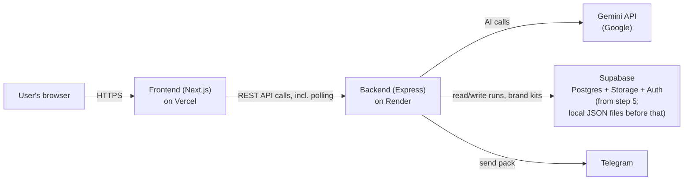

# ARCHITECTURE — VPO Studio

This document describes how VPO Studio is built. It's written for a non-technical reader — every technical term is explained in plain words the first time it appears. See `AGENTS.md` at the project root for the product flow and build plan.

---

## 1. The parts, and where each runs

| Part | What it does | Runs on |
|---|---|---|
| **Frontend** | The web pages the user sees and clicks through (Brief, Story, Direction, Look, Storyboard, Pack, Approve, History) | Vercel (a hosting service specialised for web front-ends) |
| **Backend** | Does the actual work: calls Gemini (Google's AI), tracks cost, runs long jobs, talks to the database | Render (a hosting service for backend servers) |
| **Gemini API** | Google's AI service — writes facts/scripts/prompts, scores quality, generates images | Google's servers (called over the internet by the backend only) |
| **Supabase** (from step 5) | Postgres database (structured data storage), file storage (for images), and Auth (user sign-in) | Supabase's hosted service |
| **Telegram** (from step 5) | Lets a user send their finished pack to a Telegram chat | Telegram's servers (called by the backend) |

The frontend never talks to Gemini, Supabase, or Telegram directly — it only ever talks to our own backend, which then talks to those services. This keeps every secret key on the server and gives us one place to add logging, rate limiting, and cost tracking.

---

## 2. Data model

"Data model" = the shapes of information the app stores and how they connect. Every table below belongs to a single user once Supabase is in place (step 5); before that, everything is scoped to one local test user.

| Table | Holds | Key fields (plain English) |
|---|---|---|
| `users` | One row per signed-in person | id, email, name, created date |
| `brand_kits` | One saved Brand kit per user | user it belongs to, brand name, colour palette, character description, tone of voice, constraints, preferred platforms |
| `runs` | One row per topic-to-pack journey | user it belongs to, the Brief (topic, audience, platform, aspect ratio, duration, target video model), current stage, job status, whether Autopilot is on, running total cost, created/updated dates |
| `facts` | The 5–8 facts found for a run | which run, the fact text, "stated" or "implied" label, which source it came from |
| `sources` | Where facts came from | which run, the source's URL and title, exactly as returned by Google Search grounding (never a URL typed by the AI itself) |
| `scripts` | The timestamped script (and edits to it) | which run, version number, the beats (start/end time, VISUAL, VO, ON-SCREEN text for each), word count |
| `directions` | The 3 proposed creative directions, and which was picked | which run, name, hook, angle, look, mood, one-line summary, whether selected, the user's optional note |
| `video_prompts` | Each attempt at the full video-generation prompt | which run and direction, the prompt text, the negative prompt, the 5 quality scores plus overall, which attempt number, whether it passed |
| `frames` | Each storyboard image (key frame + up to 5 more) | which run, which script beat it's for, whether it's the key frame, the image's storage location, the 6 quality scores, attempt number, status, whether it was AI-generated or user-uploaded |
| `packs` | The final publishing package | which run, final video prompt + negative prompt, title, captions per platform, hashtags, thumbnail text, posting notes, approved or not |
| `ai_call_log` | Every single call made to Gemini | which run and stage, which model, call type (text/image/grounding), token or image counts, estimated cost, outcome |

### Status values

| Field | Possible values | Meaning |
|---|---|---|
| `runs.current_stage` | `brief` → `story` → `direction` → `look` → `storyboard` → `pack` → `approve` → `done` | Which step of the flow (section 2 of AGENTS.md) the run has reached |
| `runs.job_status` | `idle`, `queued`, `running`, `waiting_confirmation`, `needs_review`, `interrupted`, `failed`, `completed` | The state of whatever background job is currently attached to the run (see section 4) |
| `ai_call_log.outcome` | `success`, `retried`, `failed` | What happened to that specific AI call |

`waiting_confirmation` = paused for a cost-confirmation click (e.g. before rendering images). `needs_review` = paused at one of the ★ human-checkpoint steps. `interrupted` = the backend restarted mid-job and the user needs to resume it manually.

---

## 3. Backend API routes

"Route" = one specific web address the frontend can call. All routes below live under `/api` and require a signed-in user from step 5 onward.

| Route | One-line purpose |
|---|---|
| `GET /api/health` | Reports whether the backend, its configured Gemini models, and the database (once added) are all working |
| `POST /api/runs` | Starts a new run from a Brief (or an uploaded script) |
| `GET /api/runs` | Lists the signed-in user's runs, for the History page |
| `GET /api/runs/:id` | Fetches one run's full current state (used for polling and reopening) |
| `POST /api/runs/:id/story` | Kicks off the Story job: fact-finding + script generation |
| `PATCH /api/runs/:id/facts` | Applies a fact removal (and triggers a script rewrite) |
| `PATCH /api/runs/:id/script` | Saves manual edits to the script |
| `POST /api/runs/:id/directions` | Generates the 3 creative directions |
| `POST /api/runs/:id/directions/:directionId/select` | Picks a direction (with optional note) and kicks off prompt writing + scoring |
| `GET /api/runs/:id/cost-estimate` | Returns the estimated cost of the next paid step, for a confirmation dialog |
| `POST /api/runs/:id/key-frame` | Confirms cost and renders the key frame |
| `POST /api/runs/:id/key-frame/upload` | Accepts a user-uploaded image instead of generating one |
| `POST /api/runs/:id/key-frame/regenerate` | Regenerates the key frame with a user note |
| `POST /api/runs/:id/storyboard` | Renders the remaining storyboard frames from the approved key frame |
| `POST /api/runs/:id/frames/:frameId/regenerate` | Regenerates one storyboard frame with a user note |
| `POST /api/runs/:id/pack` | Generates the Pack (prompts, captions, hashtags, etc.) |
| `PATCH /api/runs/:id/pack` | Saves manual edits to the Pack |
| `POST /api/runs/:id/approve` | Marks the Pack approved |
| `GET /api/runs/:id/export` | Downloads the approved Pack as a zip file |
| `POST /api/runs/:id/send-telegram` | Sends the approved Pack to a configured Telegram chat |
| `GET /api/runs/:id/jobs/:jobId` | Polls a specific background job's status (see section 4) |
| `GET /api/brand-kit` | Fetches the signed-in user's Brand kit |
| `PUT /api/brand-kit` | Creates or updates the signed-in user's Brand kit |
| `GET /api/usage` | Returns the user's running cost and daily-limit usage (built in step 7) |

---

## 4. Long jobs, polling, interruption, and resume

Some steps (research with grounding, script writing, prompt scoring loops, image generation) take several seconds to over a minute. These run as **background jobs** on the backend rather than making the user's browser wait on one long connection, which is fragile over slow networks and impossible to resume if it drops.

- **Starting a job**: an API call (e.g. `POST /api/runs/:id/story`) creates a job record — saved in the same storage as the run itself, never only in the server's memory — and returns immediately with a job ID.
- **Polling**: the frontend calls `GET /api/runs/:id/jobs/:jobId` every few seconds until the job's status is no longer `running`. This is simpler and more robust than push-based updates, and works fine at this app's scale (see Scaling, section 6).
- **Interruption**: because every job's progress is saved with the run (not just kept in memory), if the backend process restarts — a deploy, a crash, Render recycling the instance — any job that was `running` is marked `interrupted` the next time it's checked, instead of silently vanishing.
- **Resume**: the user can resume an `interrupted` run from the History page. Resuming re-runs only the specific step that was interrupted, using everything already saved (facts already found, script already written, etc.) — never redoing completed work.
- **Multiple backend copies**: because no important state lives only in memory, the backend can run as more than one copy behind Render's load balancer without jobs getting lost or duplicated — important as usage grows (section 6).
- **Autopilot** (step 7) uses this exact same job system. Instead of a person clicking "next" at each ★ checkpoint, Autopilot automatically starts the next job the moment the previous one completes — except at cost confirmations and the final approval, where it still pauses for the user, exactly like the manual flow.

---

## 5. Test mode

`TEST_MODE=true` (the default) makes every AI call — text, scoring, and image — return realistic, hand-crafted sample data instantly, at zero cost, instead of calling Gemini. This lets the whole flow be built and demonstrated (steps 2–4) before any real API key or spending is involved, and lets automated tests run without cost or flakiness. Whenever `TEST_MODE` is on, the interface shows a persistent "TEST MODE" badge so no one mistakes sample output for a real result. Turning it off (a single environment variable) is the only thing required to start making real, billed AI calls.

Separately, if the **frontend** has no backend address configured at all (e.g. viewing it standalone), it falls back to built-in sample data and shows a "SAMPLE DATA" badge — useful for step 2, before any backend exists yet.

---

## 6. Environment variables

"Environment variable" = a named setting supplied outside the code (so it can differ between your computer, a teammate's, and the live server, without editing code). Real values live in `.env` files that are never committed to Git; `.env.example` files (committed) show which variables exist with placeholder values.

### Backend (`/backend/.env`)

| Variable | Purpose |
|---|---|
| `PORT` | Port the Express server listens on |
| `TEST_MODE` | `true`/`false` — see section 5 |
| `GEMINI_API_KEY` | Google Gemini API key (server-side only, never sent to the browser or logged) |
| `GEMINI_MODEL_MAIN` | Model ID used for research, scripts, directions, and prompt writing |
| `GEMINI_MODEL_SCORING` | Cheaper model ID used only for quality scoring/review |
| `GEMINI_MODEL_IMAGE` | Model ID used for key-frame and storyboard image generation |
| `GEMINI_MAX_CONCURRENT_CALLS` | Cap on simultaneous Gemini calls |
| `GEMINI_RETRY_MAX_ATTEMPTS` | Max retries on a rate-limit error (default 2) |
| `PROMPT_SCORE_THRESHOLD` | Minimum passing score for a video prompt |
| `PROMPT_MAX_REWRITE_ATTEMPTS` | Cap on automatic prompt rewrite/rescoring loops |
| `FRAME_SCORE_THRESHOLD` | Minimum passing score for a storyboard frame |
| `FRAME_MAX_TOTAL` | Max frames per run (default 6, including the key frame) |
| `FRAME_MAX_MANUAL_REGENERATIONS` | Cap on user-requested regenerations per frame |
| `RESEARCH_CACHE_HOURS` | How long research is reused for the same user+topic (default 24) |
| `STORAGE_MODE` | `local_json` (pre-step-5) or `supabase` (from step 5) |
| `STORAGE_LOCAL_PATH` | Folder for local JSON run files (pre-step-5 only) |
| `SUPABASE_URL`, `SUPABASE_SERVICE_ROLE_KEY` | Supabase connection (from step 5) |
| `TELEGRAM_BOT_TOKEN` | Telegram bot credential for sending packs (from step 5) |
| `USER_DAILY_RUN_LIMIT` | Per-user daily cap on new runs (from step 7) |
| `USER_DAILY_COST_LIMIT` | Per-user daily cap on estimated spend (from step 7) |
| `ERROR_TRACKING_DSN` | Error-tracking service key (from step 7) |

### Frontend (`/frontend/.env`)

| Variable | Purpose |
|---|---|
| `NEXT_PUBLIC_BACKEND_URL` | Address of the backend API. If unset, the frontend shows sample data with a "SAMPLE DATA" badge |
| `NEXT_PUBLIC_SUPABASE_URL`, `NEXT_PUBLIC_SUPABASE_ANON_KEY` | Public Supabase client config for sign-in (from step 5) |

---

## 7. Cost model

Prices below are Google's published Gemini API prices, checked **2026-09-24** (see `docs/DECISIONS.md` for full sourcing). All figures are the *standard* (non-batch) tier.

**Default models**: `GEMINI_MODEL_MAIN = gemini-3.8-flash` ($0.75 / $3.75 per 1M input/output tokens), `GEMINI_MODEL_SCORING = gemini-3.5-flash-lite` ($0.30 / $2.50 per 1M input/output tokens), `GEMINI_MODEL_IMAGE = gemini-3.1-flash-image` (≈$0.045 per generated image at standard resolution). "Tokens" are the chunks of text an AI model is billed by, roughly ¾ of a word each.

### Estimated cost of one full run (6 frames, default settings)

| Stage | AI work | Estimated cost |
|---|---|---|
| Story | Facts + script (1 main-model call, grounded) | $0.007 |
| Direction | 3 directions + prompt writing/scoring loop (up to 3 attempts) | $0.016 |
| Look | 1 key-frame image | $0.045 |
| Storyboard | 5 more frames + automatic frame scoring + ~2 automatic regenerations | $0.32 |
| Pack | Captions, hashtags, notes (1 main-model call) | $0.005 |
| Google Search grounding | 1 grounded request | $0.00 (within free monthly allowance*) |
| **Total** | | **≈ $0.39** |

\* Google currently gives 5,000 free grounded search requests per month shared across all Gemini 3.x models, then charges $14 per 1,000 requests. At low volumes this stays free; see Scaling below for when it stops being free.

**Image generation is roughly 90% of the cost of a run.** Everything else is a rounding error by comparison.

### Levers that reduce cost, and their saving

| Lever | How | Saving |
|---|---|---|
| Fewer storyboard frames | Lower `FRAME_MAX_TOTAL` from 6 to 4 | ≈$0.09 (~23% of run cost) |
| Fewer automatic frame regenerations | Lower the implicit "regenerate once" retry, or raise `FRAME_SCORE_THRESHOLD` less aggressively so fewer frames fail | ≈$0.045 per regeneration avoided |
| Research reuse | Already default: identical topic within 24h skips Story stage entirely | ≈$0.007 + avoids a grounding request, per repeat run |
| Fewer prompt rewrite attempts | Lower `PROMPT_MAX_REWRITE_ATTEMPTS` from 3 to 2 | ≈$0.005 |
| Cheaper image model for storyboard, higher-quality only for the key frame | Use `gemini-3.1-flash-lite-image` for storyboard frames, reserve full quality for the key frame | Image cost per storyboard frame can drop further; exact figure to confirm against current per-model image pricing before implementation |
| User uploads their own key frame | Free — skips one image generation entirely | $0.045 |

---

## 8. Scaling

"Breaks first" = the bottleneck that would actually cause failures or unacceptable slowness at that many **active** users (people running the flow in a given day), not total signups.

| Active users | What breaks first | Fix |
|---|---|---|
| 10 | Render's free-tier instance "cold starts" (spins down when idle, then takes several seconds to wake up on the next request) | Acceptable at this scale; if it's annoying, move to a paid Render instance that stays warm |
| 100 | Gemini's per-project rate limits (requests per minute) start throttling during overlapping runs; Google Search grounding's free monthly allowance (5,000 requests, shared across the whole app) gets used up | Move to a paid Gemini billing tier with higher rate limits; budget for grounding cost beyond the free allowance ($14/1,000 requests) |
| 100 | The local-JSON-file storage (used before step 5) can't handle concurrent writes safely from multiple backend copies | Must already be on Supabase by this point (planned for step 5, well before this scale is expected) |
| 1,000 | Gemini's overall request-per-minute and tokens-per-minute quotas become the binding constraint even on a paid tier | Request a quota increase from Google, and/or spread load with request queuing so bursts don't all hit Gemini at once |
| 1,000 | A single Render backend instance runs out of CPU/memory handling many concurrent long-running jobs | Run multiple backend copies behind Render's load balancer — already possible because no job state lives only in memory (section 4) |
| 1,000 | Supabase free/starter tier database connection and storage limits are exceeded | Upgrade the Supabase plan; add connection pooling for the database |
| 1,000 | Runaway spend if many users run the flow simultaneously with no cap | Per-user daily run and cost limits (step 7) become load-bearing, not just a nice-to-have |

---

## 9. Production readiness checklist

| Item | What it means | Delivered by step |
|---|---|---|
| Accounts and data separation | Every run/Brand kit belongs to one user; server sets ownership; every query filtered to the signed-in user | 5 |
| Secrets kept server-side | API keys only in `.env`, gitignored, never sent to the browser or logged | 1 (as a rule), enforced from 3 onward |
| Limits and cost caps | Per-run frame/retry/regeneration limits; per-user daily run and cost limits | 3 (per-run), 7 (per-user daily) |
| Error tracking | Real errors captured centrally (not just shown once and lost) with an error-tracking service | 7 |
| Health checks and uptime | `/api/health` confirms backend, configured Gemini models, and database are all reachable | 3 (backend/models), 6 (full stack live) |
| Backups | Supabase's automatic database backups relied on and confirmed enabled | 5 |
| Free-tier limits and upgrade triggers | Render free tier: cold starts, limited monthly hours. Supabase free tier: limited database size, storage, and monthly active users (check Supabase's current published free-plan limits close to step 5/6, since providers change these). Gemini: free grounding allowance of 5,000 requests/month (checked 2026-09-24) | 6 (checked before going live), revisited at each scaling milestone (section 8) |
| Data privacy | Users only ever see their own runs and Brand kit; no run data shared across accounts; source links only ever come from grounding metadata, never invented | 5 |
| Model retirement handling | Model IDs are environment variables (never hardcoded); health check fails loudly if a configured model no longer exists; `docs/DECISIONS.md` tracks known retirement dates so a model can be swapped before it's shut down | 3 (mechanism), ongoing (monitoring retirement dates) |
